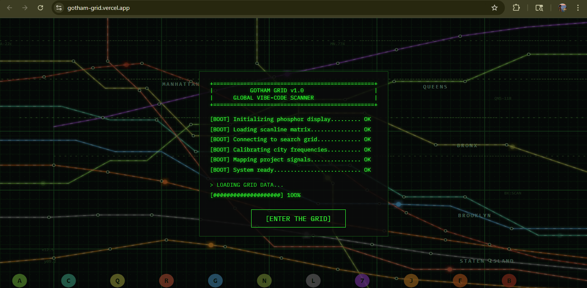
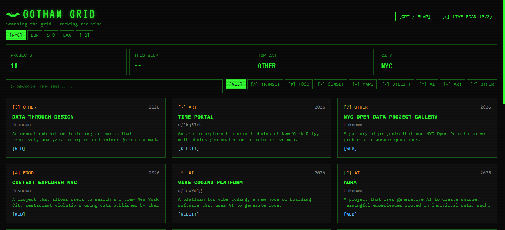

# GOTHAM GRID

**[Live demo](https://gotham-grid.vercel.app)**

Twitter has been going absolutely insane lately. People are shipping vibe-coded projects and pulling millions of views overnight, but there was no good way to actually track what was being built across different cities. So I made this retro  dashboard that scans GitHub for creative coding projects from NYC, London, SF and LA.





---

## What it does

On load the dashboard shows pre-fetched project data for each city (zero API cost). Hit "LIVE SCAN" and a multi-loop AI agent kicks in: it searches GitHub repositories directly, parses results with Groq LLaMA 3.3 70B, scores each batch for quality and refines its search queries if the results aren't good enough. Up to 3 loops, with a 30s per-loop timeout and a $0.10 cost cap per run. Every tool call is traced and logged to disk.

The aesthetic is full CRT phosphor terminal -- scanlines, VT323 font, green glow, boot sequence on first load.

---

## Agent loop

The core is in `lib/agent-loop.ts`. Each scan run:

1. Builds city-specific search queries
2. Searches GitHub repositories directly via the GitHub API (`lib/github.ts`)
3. Maps repo metadata into structured project cards
4. Calls Groq to score and parse results (tool: `parse_projects`)
5. If quality score is below 60%, refines queries and loops again
6. Caps at 3 loops or $0.10, whichever comes first

Every tool call is instrumented via `lib/instrumentation.ts` -- provider, duration, estimated cost, and status are all recorded per run. Traces saved to `data/traces/`. GitHub is tracked as a provider alongside Groq.

---

## Stack

- Next.js 14 (App Router, TypeScript)
- Tailwind CSS with custom CRT theme
- Groq SDK (LLaMA 3.3 70B Versatile)
- GitHub API for repository discovery
- Anthropic SDK (deep scan)
- Vercel

---

## Running locally

```bash
git clone https://github.com/AravindKurapati/gotham-grid
cd gotham-grid
npm install
cp .env.example .env.local   # fill in your keys
npm run dev
```

The site works without any API keys -- the static city data loads instantly. Live scan can use unauthenticated GitHub search, but `GITHUB_TOKEN` is recommended for higher rate limits. Tavily/Groq keys are only needed for legacy parser tooling and deep scan enrichment.

To regenerate the static city data:

```bash
npm run scan
```

---

## Tests

32 tests across 4 suites: agent loop quality scoring and refinement logic, cache TTL, deep scan, and rate limiting.

```bash
npm test
```

---

## Environment variables

See `.env.example`. `GROQ_API_KEY` is required for live scan. `GITHUB_TOKEN` is optional but recommended to avoid GitHub API rate limits. `SCAN_CODE` is optional -- set it to gate live scan behind an invite code.
